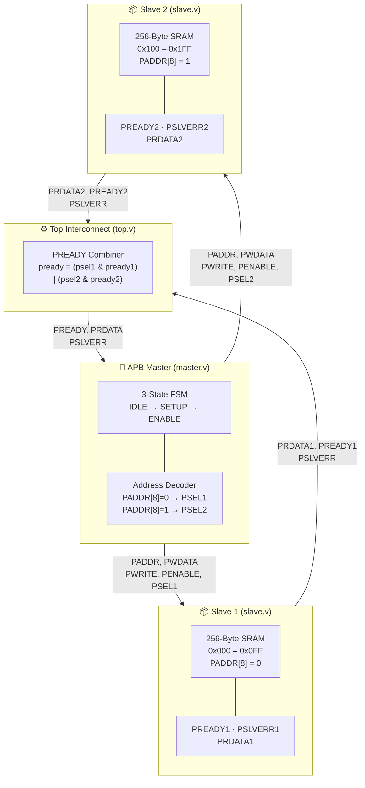
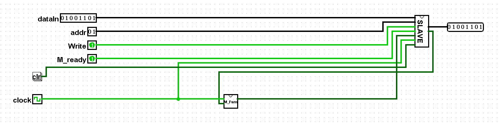
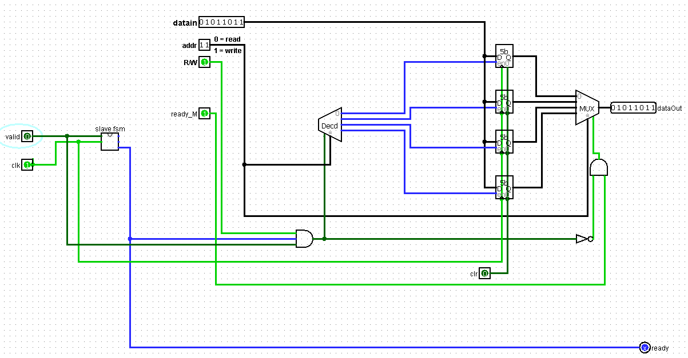
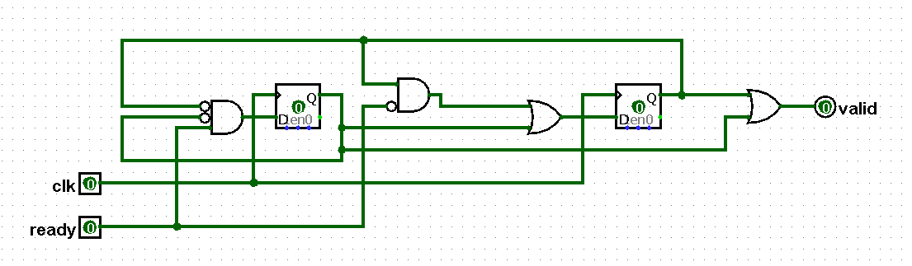
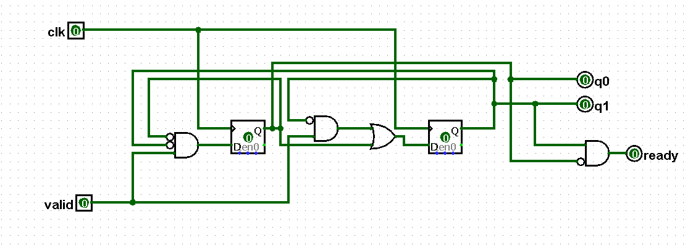

# AMBA APB (Advanced Peripheral Bus) — Protocol Implementation, FPGA Synthesis & Verification

A complete RTL design and verification suite for the **AMBA APB (Advanced Peripheral Bus)** protocol targeting the **Zybo Z7-10 FPGA board**. This repository contains two independent protocol implementations: a full APB master-slave system with automated 10-scenario verification, and a hardware handshake subsystem synthesized to bitstream and validated on physical hardware.

---

## Table of Contents
- [Protocol Overview](#protocol-overview)
- [Repository Structure](#repository-structure)
- [APB Bus System — Architecture & Implementation](#apb-bus-system--architecture--implementation)
- [Verification Suite — Test Scenarios & Results](#verification-suite--test-scenarios--results)
- [Hardware Handshake Subsystem — Architecture & FPGA Implementation](#hardware-handshake-subsystem--architecture--fpga-implementation)
- [FPGA Synthesis & Bitstream Generation](#fpga-synthesis--bitstream-generation)
- [Simulation Guide](#simulation-guide)

---

## Protocol Overview

The **Advanced Peripheral Bus (APB)** is the lowest-power segment of the AMBA protocol family, designed for connecting low-bandwidth peripherals in SoC designs. Unlike AHB/AXI, APB is non-pipelined and uses a simple 3-phase handshake (IDLE → SETUP → ENABLE) ensuring glitch-free peripheral access.

Key protocol characteristics implemented in this project:
- **3-State FSM Master:** `IDLE` → `SETUP` → `ENABLE` with full `PREADY` handshaking
- **Wait-state support:** Slave extends the `ENABLE` phase by deasserting `PREADY`
- **Error signaling:** `PSLVERR` asserted on out-of-range or invalid address access
- **Dual-slave addressing:** Upper address bit `PADDR[8]` selects between two independent 256-byte slaves
- **Hardware handshake protocol:** Separate 3-state FSM (IDLE → SEND → WAIT) for synchronous request/acknowledge bus arbitration

---

## Repository Structure

```
├── apb/                         # APB bus protocol simulation & verification
│   ├── master.v                 # APB Master — 3-state FSM, slave select, R/W control
│   ├── slave.v                  # APB Slave — 256-byte memory, PREADY, PSLVERR
│   ├── top.v                    # System interconnect — dual-slave with combined PREADY
│   └── testbench.v              # Self-checking testbench — 10 automated test cases
│
├── handshake/                   # Handshake subsystem — FPGA synthesis & hardware demo
│   ├── master.v                 # Handshake Master FSM (IDLE → SEND → WAIT)
│   ├── slave.v                  # Handshake Slave FSM (IDLE → ACCESS → DONE)
│   ├── top.v                    # Top-level FPGA wrapper with board I/O bindings
│   ├── zybo.xdc                 # Xilinx constraints for Zybo Z7-10 pin assignments
│   ├── flow.json                # SymbiFlow/F4PGA build configuration (XC7Z010)
│   ├── Makefile                 # Build system entry point
│   └── build/zybo/
│       └── top.bit              # Generated bitstream (ready to program)
│
└── README.md
```

---

## APB Bus System — Architecture & Implementation

### System Architecture

The APB subsystem implements a single-master, dual-slave architecture. The master is the sole initiator of all bus transfers; slaves respond only when selected via `PSELx`.



### Module Breakdown

**Master (`apb/master.v`)**

The APB master implements a Mealy-style 3-state FSM. From `IDLE`, it transitions to `SETUP` when `transfer` is asserted. It immediately advances to `ENABLE` on the next clock edge. In `ENABLE`, it holds until the slave asserts `PREADY = 1`. If `transfer` remains high at completion, it loops back to `SETUP` for a back-to-back transaction.

| State | PENABLE | PSEL | Action |
|:---:|:---:|:---:|:---|
| `IDLE` | 0 | 0 | Bus idle, awaiting transfer request |
| `SETUP` | 0 | 1 | Address/control presented to slave |
| `ENABLE` | 1 | 1 | Data phase active; wait for PREADY |

Address decoding is combinational inside the master: `PADDR[8] = 0` drives `PSEL1`, `PADDR[8] = 1` drives `PSEL2`.

**Slave (`apb/slave.v`)**

Each slave instance exposes a 256-byte byte-addressable memory. All bus transactions are clocked. The slave asserts `PREADY` in the same cycle the operation completes. For writes, data is committed on the rising edge when `PSEL & PENABLE & PWRITE` are active. For reads, `PRDATA` is driven from `memory[PADDR]`. Any address >= 256 asserts `PSLVERR`.

**Top Interconnect (`apb/top.v`)**

The top module connects both slaves to the shared bus. Since only one slave is selected at a time (via mutually exclusive `PSEL1`/`PSEL2`), read data is combined with a bitwise-OR of both `PRDATA` buses. The combined `PREADY` is asserted when the active slave signals completion:

```verilog
assign pready = (psel1 && pready1) || (psel2 && pready2);
```

### APB Signal Reference

| Signal | Dir | Width | Description |
|:---|:---:|:---:|:---|
| `PCLK` | In | 1 | Bus clock — all transfers synchronous to rising edge |
| `PRESETn` | In | 1 | Active-low synchronous reset |
| `PADDR` | M→S | 9 | Transfer address; bit[8] selects slave |
| `PSEL1` / `PSEL2` | M→S | 1 | Slave select — asserted in SETUP and ENABLE phases |
| `PENABLE` | M→S | 1 | Asserted only in ENABLE phase |
| `PWRITE` | M→S | 1 | `1` = Write, `0` = Read |
| `PWDATA` | M→S | 8 | Write data presented in ENABLE phase |
| `PRDATA` | S→M | 8 | Read data returned by slave when PREADY asserted |
| `PREADY` | S→M | 1 | Slave completion — extends ENABLE if deasserted |
| `PSLVERR` | S→M | 1 | Error response for invalid/out-of-range access |

---

## Verification Suite — Test Scenarios & Results

The testbench (`apb/testbench.v`) is a fully self-checking module with automatic `[PASS]` / `[FAIL]` reporting across 10 scenarios covering the complete APB operating envelope.

### Test Scenario Coverage

#### 1. Basic Write Operation
A single byte (`0xAA`) is written to Slave 1 address `0x005`. The testbench immediately reads back the same address and verifies the returned data matches the written value. This validates the fundamental write → read round-trip.

#### 2. Basic Read Operation
A standalone read from address `0x005` confirms that data persists across independent transactions, verifying that the slave's internal memory holds state between unrelated accesses.

#### 3. Address Decoding and Slave Selection
Two separate write transactions target Slave 1 (`0x005`, `PADDR[8]=0`) and Slave 2 (`0x185`, `PADDR[8]=1`) respectively. After each `SETUP` phase, `PSEL1` and `PSEL2` are sampled to confirm the decoder correctly routes each transaction. The written values are independently read back from each slave.

#### 4. Write with Wait-State Insertion
A write is issued to address `0x010`. The slave may insert wait states by deasserting `PREADY`. The testbench waits for `PREADY = 1` and then reads back the value to confirm data integrity was maintained across the stalled transfer.

#### 5. Read with Wait-State Insertion
The same address `0x010` is read after the wait-state write scenario. This verifies that the master correctly holds `PENABLE = 1` and `PSEL = 1` throughout the stalled ENABLE phase without corrupting the read data path.

#### 6. Error Response (`PSLVERR`) Validation
A write is issued to address `0x1FF`. The testbench samples `PSLVERR` at the ENABLE phase and reports whether the slave asserted the error flag. This validates the boundary-check logic within the slave.

#### 7. Burst of Sequential and Interleaved Transfers
Three consecutive writes to addresses `0x001`, `0x002`, and `0x003` are followed by three sequential reads. The testbench then performs interleaved write-then-read pairs on the same addresses (`0xAB`, `0xCD`, `0xEF`), verifying that back-to-back transfers share the bus correctly without corruption.

#### 8. Out-of-Range Address Boundary Check
A write is issued to the extreme address `0x1FF` with `PSLVERR` monitoring. This complements scenario 6 by specifically targeting the upper boundary of the 9-bit address space to confirm decoder stability.

#### 9. Mid-Transaction Reset Behavior
While a transfer is in progress to address `0x050`, `PRESETn` is asynchronously deasserted. The testbench immediately samples `PSEL1`, `PSEL2`, `PENABLE`, and `PREADY`, asserting all should return to zero. The master FSM state register is also read directly and checked for `IDLE (2'b00)`.

#### 10. Randomized Transaction Stress Test (20 Iterations)
A `$random`-driven loop issues 20 random read or write operations to randomly generated addresses within Slave 1's range (`0x000 – 0x07F`). Write operations are immediately followed by a readback to verify data integrity. Read-only iterations perform stability checks on existing memory contents.

---

## Hardware Handshake Subsystem — Architecture & FPGA Implementation

The handshake subsystem is an independent RTL design demonstrating synchronous request/acknowledge bus arbitration. It was synthesized through the full P&R flow and programmed onto the **Zybo Z7-10 development board**.

### Protocol Description

The handshake protocol establishes a two-party synchronization channel between a master and slave without a shared address/data bus concept — the slave processes one transaction at a time and signals completion via `acknowledge`. The master holds the transaction valid until acknowledgment is received.

### Handshake Master FSM (`handshake/master.v`)

```
      request                      always              acknowledge
IDLE ──────────► SEND ──────────► WAIT ──────────────► IDLE
  ◄─────────────────────────────────── !acknowledge (hold)
```

| State | `transaction_valid` | Action |
|:---:|:---:|:---|
| `IDLE` | 0 | Awaiting `request` assertion |
| `SEND` | 1 | Presents address, data, and R/W to slave |
| `WAIT` | 1 | Holds transaction stable; waits for `acknowledge` |

### Handshake Slave FSM (`handshake/slave.v`)

```
   transaction_valid              always               !transaction_valid
IDLE ──────────────► ACCESS ──────────────► DONE ──────────────────► IDLE
                                              ◄─── transaction_valid (hold)
```

| State | `acknowledge` | Action |
|:---:|:---:|:---|
| `IDLE` | 0 | Awaiting valid transaction |
| `ACCESS` | 0 | Performing memory read or write |
| `DONE` | 1 | Signals completion to master |

The slave contains a 4-entry × 8-bit register file (`data_memory[3:0]`). On `transaction_rw = 1` (write), `transaction_data` is stored at `transaction_address`. On `transaction_rw = 0` (read), `output_data` is loaded from memory.

### Logisim Circuit Diagrams

The master and slave FSMs were first designed and validated in Logisim before RTL implementation.

**Master Logisim Circuit:**



**Slave Logisim Circuit:**



**Master FSM State Diagram:**



**Slave FSM State Diagram:**



### FPGA I/O Mapping (Zybo Z7-10)

The top-level wrapper (`handshake/top.v`) exposes the handshake system through the Zybo board's switches, buttons, and LEDs:

| Port | Direction | Board Resource | Package Pin | Description |
|:---|:---:|:---:|:---:|:---|
| `clk` | In | Slide Switch SW0 | G15 | System clock |
| `rst` | In | Slide Switch SW1 | P15 | Active-high reset |
| `start` | In | Slide Switch SW2 | W13 | Initiates handshake transaction |
| `rw` | In | Slide Switch SW3 | T16 | `1` = Write, `0` = Read |
| `dataFpga[0:3]` | Out | LEDs LD0–LD3 | R18, P16, V16, Y16 | Lower 4 bits of received data |
| `valid` | Out | RGB LED (Green) | L15 | `transaction_valid` indicator |
| `ready` | Out | RGB LED (Blue) | G17 | `acknowledge` indicator |

The constraint file `zybo.xdc` also defines the clock timing constraint:
```
create_clock -add -name sys_clk_pin -period 8.00 -waveform {0 4} [get_ports { clk }]
```
This sets a 125 MHz clock period (8 ns) matching the Zybo Z7-10's default oscillator input.

---

## FPGA Synthesis & Bitstream Generation

The handshake design is built using **F4PGA (SymbiFlow)** — an open-source FPGA toolchain for Xilinx 7-series devices.

### Prerequisites

Install F4PGA and its dependencies:
```bash
# Install conda environment manager
wget https://repo.anaconda.com/miniconda/Miniconda3-latest-Linux-x86_64.sh
bash Miniconda3-latest-Linux-x86_64.sh

# Create and activate F4PGA environment
conda create -n f4pga -c conda-forge python=3.9
conda activate f4pga
pip install f4pga

# Install XC7 device support
f4pga install xc7
```

### Build Flow

The `flow.json` defines the complete synthesis and implementation pipeline for the `XC7Z010-1CLG400C` device.

**`handshake/flow.json`:**

```json
{
    "default_part": "XC7Z010-1CLG400C",
    "values": {
        "top": "top"
    },
    "dependencies": {
        "sources": [
            "master.v",
            "slave.v",
            "top.v"
        ],
        "synth_log": "synth.log",
        "pack_log": "pack.log"
    },
    "XC7Z010-1CLG400C": {
        "default_target": "bitstream",
        "dependencies": {
            "build_dir": "build/zybo",
            "xdc": [
                "zybo.xdc"
            ]
        }
    }
}
```

The build stages are:
1. **Synthesis (Yosys):** Reads `master.v`, `slave.v`, `top.v` → produces optimized netlist `top.json`
2. **Technology Mapping:** ABC9 optimization → `top.json.post_abc9.ilang`
3. **Packing (VPR):** Maps netlist to CLBs and IOBs → `top.eblif`
4. **Placement:** Assigns mapped logic to physical fabric locations → `top.place`
5. **Routing:** Interconnects placed primitives → `top.route`
6. **Bitstream (FASM):** Converts routing database to bitstream format → `top.bit`

### Running the Build

**`handshake/Makefile`:**

```makefile
current_dir := ${CURDIR}

TOP := top

SOURCES := \
	${current_dir}/master.v \
	${current_dir}/slave.v \
	${current_dir}/top.v

ifeq ($(TARGET),arty_100)
  XDC := ${current_dir}/arty.xdc

else ifeq ($(TARGET),nexys4ddr)
  XDC := ${current_dir}/nexys4ddr.xdc

else ifeq ($(TARGET),zybo)
  XDC := ${current_dir}/zybo.xdc

else ifeq ($(TARGET),nexys_video)
  XDC := ${current_dir}/nexys_video.xdc

else ifeq ($(TARGET),basys3)
  XDC := ${current_dir}/basys3.xdc

endif

include ${current_dir}/../../common/common.mk
```

```bash
cd handshake/

# Build bitstream for Zybo Z7-10
make TARGET=zybo

# Or invoke F4PGA directly
f4pga build --flow flow.json
```

**`handshake/zybo.xdc` — Pin Constraints:**

```tcl
## Zybo Z7-10

## Switches (Inputs)
set_property -dict { PACKAGE_PIN G15 IOSTANDARD LVCMOS33 } [get_ports { clk }]
set_property -dict { PACKAGE_PIN P15 IOSTANDARD LVCMOS33 } [get_ports { rst }]
set_property -dict { PACKAGE_PIN W13 IOSTANDARD LVCMOS33 } [get_ports { start }]
set_property -dict { PACKAGE_PIN T16 IOSTANDARD LVCMOS33 } [get_ports { rw }]

## LEDs (Outputs — received data nibble)
set_property -dict { PACKAGE_PIN R18 IOSTANDARD LVCMOS33 } [get_ports { dataFpga[0] }]
set_property -dict { PACKAGE_PIN P16 IOSTANDARD LVCMOS33 } [get_ports { dataFpga[1] }]
set_property -dict { PACKAGE_PIN V16 IOSTANDARD LVCMOS33 } [get_ports { dataFpga[2] }]
set_property -dict { PACKAGE_PIN Y16 IOSTANDARD LVCMOS33 } [get_ports { dataFpga[3] }]

## RGB LEDs (Status indicators)
set_property -dict { PACKAGE_PIN L15 IOSTANDARD LVCMOS33 } [get_ports { valid }]
set_property -dict { PACKAGE_PIN G17 IOSTANDARD LVCMOS33 } [get_ports { ready }]

## Clock timing constraint — 125 MHz (8 ns period)
create_clock -add -name sys_clk_pin -period 8.00 -waveform {0 4} [get_ports { clk }]
```

**Generated Bitstream:**

After a successful build, the bitstream is located at `build/zybo/top.bit` and is ready to be programmed directly onto the board.

### Programming the Zybo Z7-10

**Using OpenOCD:**
```bash
openocd -f board/digilent_zybo.cfg \
        -c "init; pld load 0 build/zybo/top.bit; exit"
```

**Using Vivado Hardware Manager (TCL Console):**
```tcl
open_hw_manager
connect_hw_server
open_hw_target
set_property PROGRAM.FILE {build/zybo/top.bit} [current_hw_device]
program_hw_devices [current_hw_device]
```

**Using xc3sprog:**
```bash
xc3sprog -c jtaghs1 build/zybo/top.bit
```

### Hardware Operation on the Board

After programming:

1. **SW2 (`start`) = OFF** — System in IDLE; both status LEDs off
2. **SW3 (`rw`) = ON** — Select write mode
3. **SW2 (`start`) = ON** — Assert `request`; master enters SEND state, Green LED lights
4. **Clock 2 cycles** — SEND → WAIT → IDLE (master); IDLE → ACCESS → DONE (slave)
5. **Blue LED** — Illuminates when slave reaches DONE and asserts `acknowledge`
6. **LEDs LD0–LD3** — Display lower nibble of stored/retrieved data byte (`8'd10` by default)

For read mode (SW3 = OFF), the data previously written to `data_memory[1]` appears on the LEDs after the slave completes ACCESS.

---

## Simulation Guide

### APB System Simulation

```bash
# Compile all APB modules
iverilog -o apb_sim apb/master.v apb/slave.v apb/top.v apb/testbench.v

# Run simulation
vvp apb_sim

# View waveforms
gtkwave apb_testbench.vcd
```

### Handshake Simulation

```bash
# Compile handshake modules
iverilog -o hs_sim handshake/master.v handshake/slave.v handshake/top.v

# Run
vvp hs_sim
```
